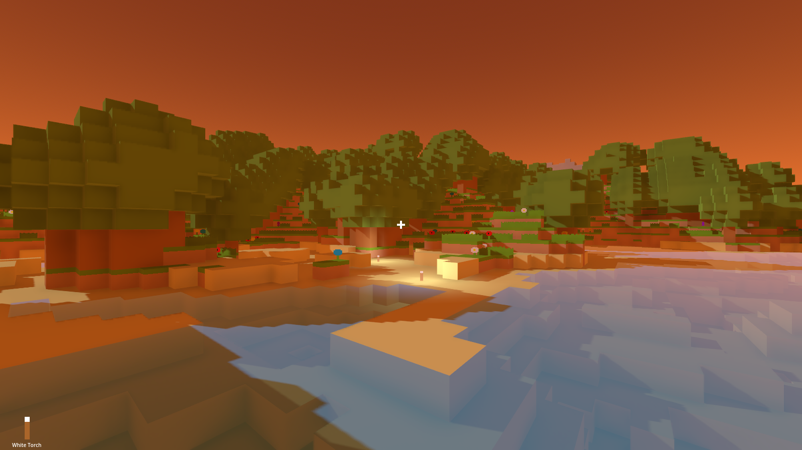

# GDCraft

Tiny Minecraft clone in Godot using GDScript

# Features

- Procedural world generation
- Asynchronous chunk loading
- Blocks and plants
- Persistent worlds
- Day and night cycle
- Dynamic lighting
